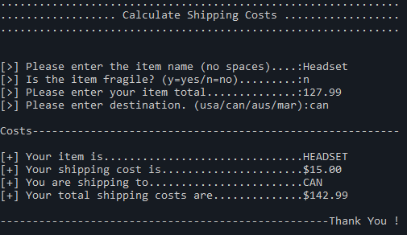

# Description
A simple program for calculating the shipping costs based on the item total cost and destination of the shipment.

- Prompt and retrieve the following input from the user:
    - Item name
    - Is the item fragile (add in extra fee if the item is fragile)
    - The order total (without shipping)
    - The destination to which the item will be shipped

The program writes to both the console window and a file named "Order.txt"

